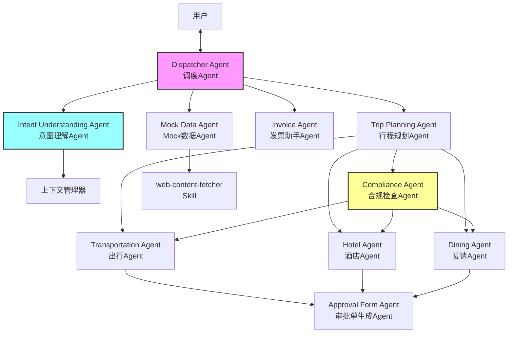

# 需求文档 - 智能商旅助手

## 引言

本文档描述了一个多Agent协作的智能商旅助手系统。该系统通过自然语言理解用户出差需求，由多个专业Agent协同工作：调度Agent负责协调、意图理解Agent解析语义、各专业规划Agent负责细分领域、合规检查Agent确保符合差旅标准、审批单生成Agent汇总输出。最终协调完成行程规划、住宿预订、宴请安排，并生成报销审批单。

## 词汇表

- **Dispatcher Agent**: 调度Agent，负责接收用户请求、分发任务、协调各Agent工作流程
- **Intent Understanding Agent**: 意图理解Agent，负责解析用户自然语言输入，提取语义信息，管理对话上下文
- **Trip Planning Agent**: 行程规划Agent，负责协调出行、住宿、宴请的规划流程
- **Compliance Agent**: 合规检查Agent，负责根据差旅标准验证各项费用是否合规
- **Transportation Agent**: 出行Agent，负责搜索和推荐机票、火车票等交通方案
- **Hotel Agent**: 酒店Agent，负责搜索和推荐酒店住宿方案
- **Dining Agent**: 宴请Agent，负责搜索和推荐餐厅宴请方案
- **Approval Form Agent**: 审批单生成Agent，负责汇总信息并生成报销审批单
- **Invoice Agent**: 发票助手Agent，负责识别发票图片/PDF并提取报销字段
- **Mock Data Agent**: Mock数据Agent，负责获取真实数据并生成测试用mock数据
- **COT (Chain of Thought)**: 思维链，Agent的推理和决策框架
- **差标**: 差旅费用标准，根据职级设定的费用上限
- **审批单**: 报销审批文档，包含出行、住宿、宴请等费用的明细

## 系统架构



## Agent职责定义

### Dispatcher Agent（调度Agent）

**核心职责**：
- 接收用户所有输入
- 判断请求类型（行程规划/发票处理/Mock数据生成）
- 创建和管理Agent协作工作流
- 协调各Agent之间的消息传递
- 管理对话状态和上下文

### Intent Understanding Agent（意图理解Agent）

**核心职责**：
- 解析用户自然语言输入的语义
- 识别用户意图（出差请求/信息补充/修改选择/确认等）
- 提取结构化信息（出发地、目的地、时间、人数等）
- 判断信息完整性，识别缺失字段
- 管理会话上下文，支持多轮对话

**COT框架**：
```
输入：用户自然语言
  → 语义解析层：提取实体、时间、地点、动作
  → 意图分类层：判断用户意图类型
  → 信息提取层：结构化输出提取的信息
  → 完整性检查层：与必填字段对比，输出缺失列表
```

### Compliance Agent（合规检查Agent）

**核心职责**：
- 维护差旅标准规则库
- 验证各项费用是否在差标范围内
- 对超标项提供替代方案建议
- 生成合规报告

**规则引擎**：
```
输入：费用项（类型、金额、职级）
  → 规则匹配：根据费用类型和职级查找对应差标
  → 合规判定：比较费用与差标
  → 结果输出：合规/超标 + 差额信息
```

### Transportation Agent（出行Agent）

**核心职责**：
- 搜索航班信息（出发地、目的地、日期）
- 搜索火车票信息
- 按价格、时间、合规性筛选方案
- 生成出行推荐报告

### Hotel Agent（酒店Agent）

**核心职责**：
- 搜索目标区域酒店
- 按星级、价格、位置筛选
- 计算酒店与客户位置的距离
- 生成酒店推荐报告（含替代方案）

### Dining Agent（宴请Agent）

**核心职责**：
- 搜索目标区域餐厅
- 按菜系、人均消费、位置筛选
- 生成宴请推荐报告（含菜品建议）

### Approval Form Agent（审批单生成Agent）

**核心职责**：
- 汇总各Agent推荐结果
- 生成结构化审批单
- 输出PDF文档

### Invoice Agent（发票助手Agent）

**核心职责**：
- 识别发票图片/PDF（OCR+多模态LLM）
- 提取报销字段
- 生成报销信息草稿

### Mock Data Agent（Mock数据Agent）

**核心职责**：
- 调用web-content-fetcher获取真实数据
- 解析和结构化数据
- 生成1:1 Mock数据集

## 需求

### 需求1：多LLM网关服务

**用户故事：** AS 开发者，我想要一个统一的LLM调用网关，以便在不同的LLM提供商之间切换

#### Acceptance Criteria

1. WHEN 系统需要调用LLM进行推理，THEN LLM Gateway SHALL 根据配置选择对应的LLM Provider进行调用
2. WHEN 主LLM（紫东太初kimi k2.5）调用失败，THEN LLM Gateway SHALL 自动切换到备用LLM并重试
3. WHEN LLM返回结果，THEN LLM Gateway SHALL 统一封装返回格式，对上层Agent屏蔽LLM差异
4. THE LLM Gateway SHALL 支持至少3个LLM Provider的接入配置

### 需求2：Dispatcher Agent - 任务调度

**用户故事：** AS 系统，我想要调度Agent协调多个专业Agent工作，以便完成复杂的商旅规划任务

#### Acceptance Criteria

1. WHEN Dispatcher Agent 接收到用户输入，THEN Agent SHALL 判断请求类型并创建对应工作流
2. WHEN 工作流创建后，THEN Dispatcher Agent SHALL 按序分发子任务到专业Agent
3. WHEN 专业Agent返回结果，THEN Dispatcher Agent SHALL 协调结果汇总并决定下一步操作
4. THE Dispatcher Agent SHALL 支持并行调用多个不相关联的专业Agent

### 需求3：Intent Understanding Agent - 意图识别

**用户故事：** AS 出差员工，我想要系统真正理解我的自然语言表达，而不是依赖关键词匹配

#### Acceptance Criteria

1. THE Intent Understanding Agent SHALL 基于LLM的语义理解能力解析用户输入，而非使用正则表达式或关键词映射
2. WHEN 用户使用非标准表述，THEN Intent Understanding Agent SHALL 正确识别为出差需求
3. WHEN 用户表述模糊或有多重含义，THEN Intent Understanding Agent SHALL 通过追问澄清而非猜测
4. THE Intent Understanding Agent SHALL 支持上下文记忆，允许多轮对话中引用之前的信息

### 需求4：Intent Understanding Agent - 信息补全追问

**用户故事：** AS 出差员工，我想要系统主动询问缺失的出差信息，以便生成准确的行程规划

#### Acceptance Criteria

1. WHEN Intent Understanding Agent 完成语义解析，THEN Agent SHALL 检查必填信息的完整性
2. IF 必填信息缺失，THEN Intent Understanding Agent SHALL 生成追问列表
3. WHEN 生成追问列表，THEN Intent Understanding Agent SHALL 依次追问以下信息（每轮最多3个问题）：
   - 用户职级
   - 出差目的
   - 客户位置
   - 出行方式（飞机/火车）
   - 预计出发时间
   - 预计返程时间
   - 住宿要求（酒店星级/位置偏好）
   - 是否涉及宴请
4. IF 用户回答涉及宴请，THEN Intent Understanding Agent SHALL 继续追问：
   - 宴请时间
   - 宴请地点
   - 饮食要求（菜系/忌口）
   - 计划花费金额
5. WHEN 用户提供了某项信息，THEN Intent Understanding Agent SHALL 更新上下文并跳过该问题的后续追问
6. WHEN 所有必填信息已收集完毕，THEN Intent Understanding Agent SHALL 通知 Dispatcher Agent 进入行程规划阶段

### 需求5：Compliance Agent - 合规检查

**用户故事：** AS 系统，我想要合规检查Agent验证各项费用是否符合差旅标准，以便确保报销合规

#### Acceptance Criteria

1. WHEN Compliance Agent 接收费用项和职级信息，THEN Agent SHALL 根据差标规则判断是否合规
2. THE Compliance Agent SHALL 维护以下差标规则：
   - 机票费用上限（按职级）
   - 火车票费用上限（按职级）
   - 酒店住宿上限（按职级+城市级别）
   - 宴请人均上限（按职级）
3. IF 费用超标，THEN Compliance Agent SHALL 计算超标金额并生成替代方案建议
4. THE Compliance Agent SHALL 输出结构化的合规报告，包含：
   - 各费用项是否合规
   - 超标金额（如有）
   - 替代方案建议（如有）

### 需求6：Transportation Agent - 出行方案推荐

**用户故事：** AS 出差员工，我想要系统推荐符合公司差旅标准的出行方案，以便选择最合适的交通方式

#### Acceptance Criteria

1. WHEN Transportation Agent 接收出行需求，THEN Agent SHALL 搜索符合条件的航班和火车票
2. WHEN Transportation Agent 获取搜索结果，THEN Agent SHALL 调用 Compliance Agent 验证合规性
3. WHEN 用户期望的出行方式为火车/高铁且费用高于特价机票，THEN Transportation Agent SHALL 同时展示：
   - 符合用户期望的火车/高铁车次及价格
   - 符合差标的特价机票信息
   - 明确标注两种方案的价差
4. THE Transportation Agent SHALL 展示每个出行方案时包含：出发时间、到达时间、历时、费用、是否符合差标

### 需求7：Hotel Agent - 住宿方案推荐

**用户故事：** AS 出差员工，我想要系统推荐符合差旅标准的酒店，并在超标时提供替代方案

#### Acceptance Criteria

1. WHEN Hotel Agent 接收住宿需求，THEN Agent SHALL 在目标区域搜索符合要求的酒店
2. WHEN Hotel Agent 获取搜索结果，THEN Agent SHALL 调用 Compliance Agent 验证合规性
3. IF 用户期望酒店星级超标，THEN Hotel Agent SHALL 生成双重推荐：
   - **推荐A**：目标区域内符合差标的3家酒店，包含距离客户位置、房价、主要设施
   - **推荐B**：超标区域外的3家高档/豪华酒店，包含距离客户位置、房价、主要设施、最佳交通方案及预计通勤时间
4. THE Hotel Agent SHALL 在推荐时标注每家酒店与客户位置的距离（公里数）和最佳交通方式

### 需求8：Dining Agent - 宴请方案推荐

**用户故事：** AS 出差员工，我想要系统推荐符合差旅标准的宴请场所，并在超标时提供替代方案

#### Acceptance Criteria

1. WHEN Dining Agent 接收宴请需求，THEN Agent SHALL 搜索符合条件的餐厅
2. WHEN Dining Agent 获取搜索结果，THEN Agent SHALL 调用 Compliance Agent 验证合规性
3. IF 用户计划花费金额高于宴请差标，THEN Dining Agent SHALL 执行双重展示：
   - **超标提示**：告知用户计划花费超出差标上限
   - **合规推荐**：3家符合差标且满足用户其他要求的餐厅，包含：
     - 餐厅名称、位置、菜系
     - 预估人均消费
     - 推荐菜品及数量建议
     - 预计总花费
4. IF 用户计划花费在差标范围内，THEN Dining Agent SHALL 推荐3家符合用户要求的餐厅
5. THE Dining Agent SHALL 确保推荐菜品的数量与宴请人数匹配

### 需求9：Approval Form Agent - 审批单生成

**用户故事：** AS 出差员工，我想要系统一键生成审批单，以便快速提交报销申请

#### Acceptance Criteria

1. WHEN Approval Form Agent 接收所有规划结果，THEN Agent SHALL 生成审批单PDF文档
2. THE 审批单 SHALL 包含以下信息：
   - 出差基本信息（员工姓名、职级、部门、出差目的）
   - 行程详情（出发地、目的地、出行方式、出发时间、返程时间）
   - 住宿安排（酒店名称、入住日期、退房日期、房价）
   - 宴请安排（餐厅名称、宴请日期、预估花费、菜品建议）
   - 费用汇总（各项费用小计、总计）
   - 差标对比（各项是否合规、超标金额）
3. THE 审批单 SHALL 支持打印和电子存档

### 需求10：Invoice Agent - 发票识别

**用户故事：** AS 出差员工，我想要系统自动识别发票内容并提取报销字段，以便简化报销流程

#### Acceptance Criteria

1. WHEN 用户上传发票图片（JPG/PNG）或PDF文件，THEN Invoice Agent SHALL 自动识别发票内容
2. THE Invoice Agent SHALL 使用OCR和多模态LLM提取以下字段：
   - 发票代码
   - 发票号码
   - 开票日期
   - 购买方名称
   - 销售方名称
   - 商品/服务明细
   - 金额（含税）
   - 税率
   - 发票类型
3. IF OCR识别置信度低于阈值，THEN Invoice Agent SHALL 标记该字段为"待确认"并提示用户核对
4. THE Invoice Agent SHALL 支持批量上传多张发票

### 需求11：Invoice Agent - 报销流程发起

**用户故事：** AS 出差员工，我想要系统自动填充报销信息并发起审批流程，以便减少手动填写

#### Acceptance Criteria

1. WHEN Invoice Agent 完成发票识别，THEN 系统 SHALL 生成报销信息草稿
2. THE 系统 SHALL 展示识别的发票信息供用户确认
3. WHEN 用户确认发票信息，THEN 系统 SHALL 调用审批单生成功能创建正式审批文档
4. THE 系统 SHALL 支持将报销信息导出为标准格式（PDF/Excel）供用户手动提交至OA系统

### 需求12：Mock Data Agent - 真实数据获取

**用户故事：** AS 开发者，我想要系统获取真实的机票、酒店、火车票数据用于测试，以便验证功能正确性

#### Acceptance Criteria

1. WHEN Mock Data Agent 接收到数据获取请求，THEN Agent SHALL 调用web-content-fetcher skill获取真实数据
2. THE Mock Data Agent SHALL 支持获取以下数据：
   - 机票信息（航班号、出发地、目的地、起飞时间、到达时间、价格）
   - 酒店信息（名称、位置、星级、价格、设施）
   - 火车票信息（车次、出发地、目的地、出发时间、到达时间、价格）
   - 餐厅信息（名称、位置、菜系、人均消费）
3. WHEN web-content-fetcher返回数据，THEN Mock Data Agent SHALL 解析并结构化数据

### 需求13：Mock Data Agent - Mock数据生成

**用户故事：** AS 开发者，我想要系统生成一比一的Mock数据，以便在不调用真实API的情况下进行测试

#### Acceptance Criteria

1. WHEN Mock Data Agent 完成真实数据获取，THEN Agent SHALL 生成1:1比例的Mock数据集
2. THE Mock数据 SHALL 保持与真实数据相同的字段结构和数据分布
3. THE Mock数据 SHALL 包含合理的变体（不同日期、不同价格区间）以覆盖测试场景
4. THE Mock数据 SHALL 以JSON格式输出，支持直接导入测试环境

### 需求14：Agent COT框架

**用户故事：** AS 开发者，我想要每个Agent都具备独立的思维链能力，以便真正理解用户意图而非简单匹配

#### Acceptance Criteria

1. THE 每个专业Agent SHALL 实现独立的COT推理框架，包含：
   - **意图理解层**：解析用户自然语言输入，提取语义信息
   - **知识检索层**：检索相关的差旅政策、公司规定、历史案例
   - **推理决策层**：基于语义理解和知识库进行多步推理
   - **响应生成层**：生成符合上下文的自然语言响应
2. WHEN Agent处理用户输入，THEN Agent SHALL 先执行COT推理再生成响应
3. THE Agent SHALL 支持展示推理过程（可调试模式），包含：
   - 意图识别的中间结果
   - 知识检索的匹配项
   - 最终决策的依据
4. THE Agent SHALL 确保COT推理结果可复现，支持相同输入产生一致的理解

## 附录：待确认信息

以下信息需要在后续阶段补充明确：

1. **差旅标准定义**：需要提供公司差旅报销标准文档，包含各职级对应的：
   - 机票费用上限
   - 火车票费用上限
   - 酒店住宿上限（按城市级别）
   - 宴请人均上限

2. **LLM API配置**：需要提供紫东太初kimi k2.5的API调用方式和密钥

3. **审批单格式**：需要确认审批单的模板格式（是否需要包含特定字段/Logo等）
